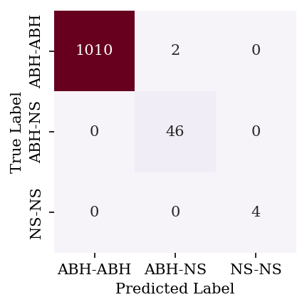
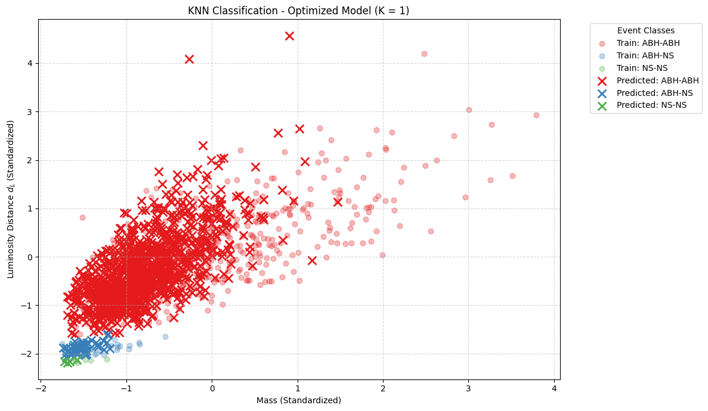
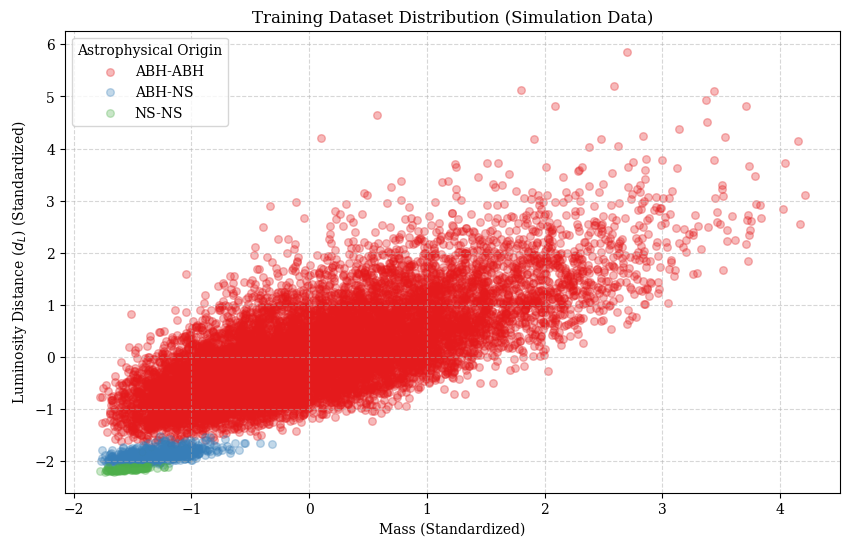
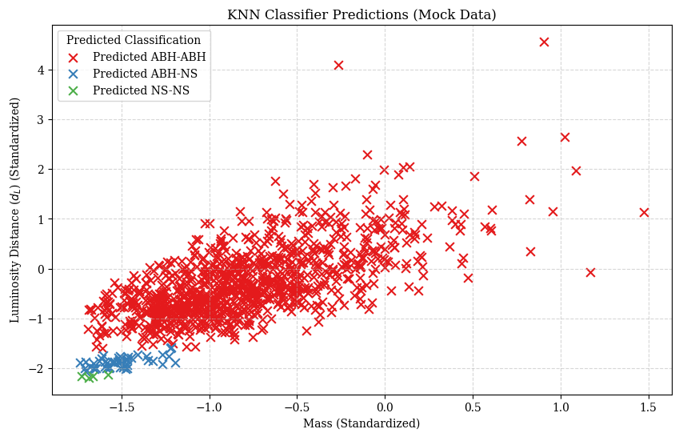
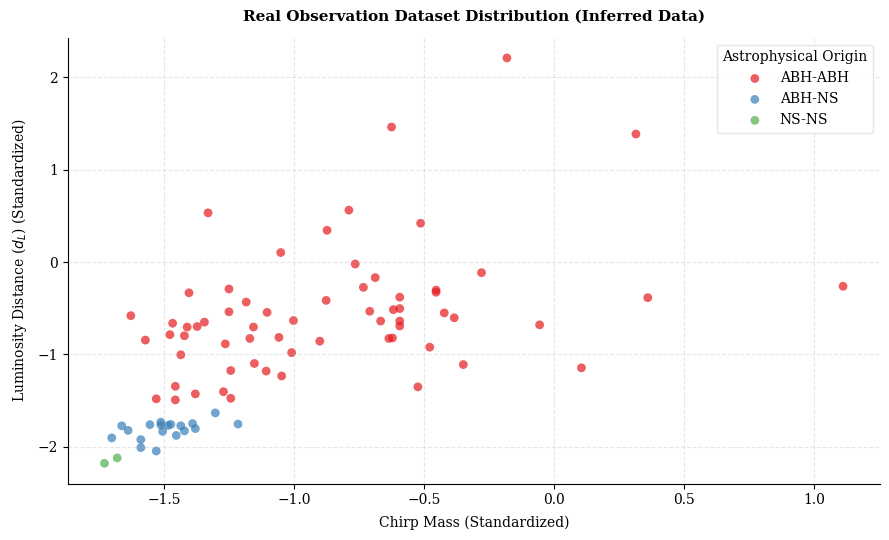

# Classification of Gravitational Wave Progenitors by the ”K Nearest Neighbors” method (Machine Learning)

This project builds a classification model to identify the source of gravitational wave events, distinguishing between BH–BH, BH–NS, and NS–NS mergers.

The model is trained on simulated data using chirp mass, luminosity distance (dL), and signal-to-noise ratio (SNR), and then applied to real observed events.

---

## Objective

The goal of this project is to classify gravitational wave events according to their astrophysical source, distinguishing between black hole–black hole (ABH–ABH), black hole–neutron star (ABH–NS), and neutron star–neutron star (NS–NS).

## Dataset

- Simulated gravitational wave events for training.
- Features:
  - Chirp mass
  - Luminosity Distance (dL)
  - Signal-to-Noise Ratio (SNR)
- Real observed events used for inference and validation.

Note: the dataset used in this project was provided for the course and is confidential, so it is not included in this repository.

## Methodology

The work flow consists of:

1. Exploratory data analysis
2. Preprocessing
3. Model training
4. Evaluation
5. Inference

## Results



The best model was an optimized KNN with K=1 and uniform weights, reaching an accuracy of 1.00 and an overall F1-score of 0.99 on th test data. By class, ABH-ABH and NS-NS scored 1.00 F1, while ABH-NS scored 0.98.



The final model (K = 1) classifies events by combining the training distribution with the predictions on the mock data. Most events are calssifies as ABH-ABH, with a smaller number of ABH-NS and NS-NS predictions, consistent with the distribution seen in the training data.

Applied to the real observed events, the model classified (64 events) 75.3% as ABH–ABH, (19 events) 22.4% as ABH–NS, and (2 events) 2.4% as NS–NS.

<details>
  <summary>See training data distribution and initial predictions</summary>

  
  
  
  
</details>

## Libraries

The project developed in Python using the following libraries:

- Python
- NumPy
- Pandas
- Scikit-learn
- Matplotlib
- Seaborn

## How to run

```bash
git clone https://github.com/MartaSantome/knn_project.git
cd knn_project
pip install numpy pandas scikit-learn matplotlib seaborn jupyter
jupyter notebook ProyectosI.ipynb
```

Since the dataset is confidential, the data-loading cells will not run without your own data. To use it with different data, format it with the same columns (chirp mass, dL, SNR, label) and update the loading cell.
